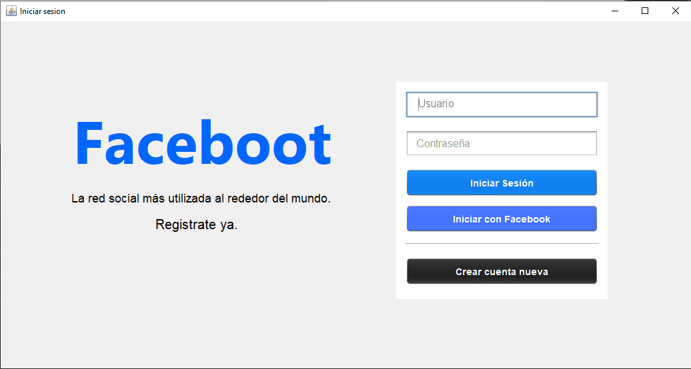

# Blackboard

## Tabla de Contenidos

- [Blackboard](#blackboard)
  - [Tabla de Contenidos](#tabla-de-contenidos)
  - [Preview](#preview)
    - [Screenshot](#screenshot)
  - [Proyecto](#proyecto)
    - [Links](#links)
  - [Proceso](#proceso)
    - [Construido con:](#construido-con)
  - [Autores](#autores)

## Preview

### Screenshot

Página del login

## Proyecto

Este proyecto fue realizado como proyecto final de la materia Arquitectura de software, implementando la arquitectura de Blackboard y utilizando sockets para la transferencia de datos.

### Links

- Repositorio: [Solución](https://github.com/lMahesvara/blackboard)
- Repositorio: [Front](https://github.com/lMahesvara/faceboot)
- Repositorio: [Entidades](https://github.com/roberto-rw/entidades)
- 

## Proceso

### Construido con:

- Java
- MongoDB
- MySQL
- Log4j
- Twilio
- JavaMail

## Autores

- GitHub - [@lMahesvara](https://github.com/lMahesvara)
- GitHub - [@Vastem](https://github.com/Vastem)
- GitHub - [@roberto-rw](https://www.github.com/oberto-rw)
- GitHub - [@NogyOne](https://github.com/NogyOne)
